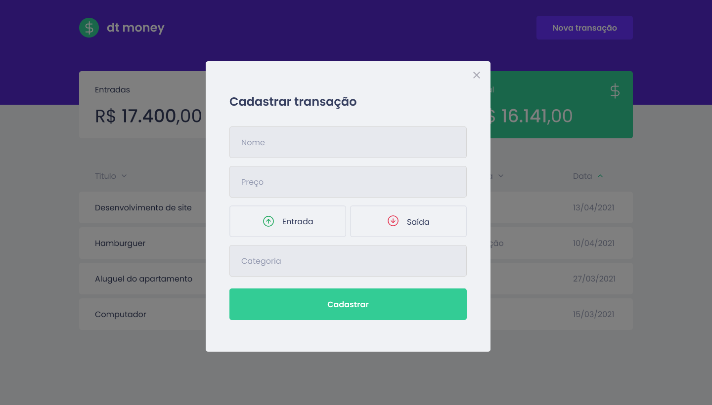

<p align="center">
  
  
  <a href="https://github.com/gabrielvbauer/dtmoney/commits/master">
    
  </a>
   
  <a href="https://github.com/gabrielvbauer">
    
  </a>
 
</p>
<h1 align="center">
    
</h1>

<h4 align="center"> 
	🚧  dtmoney 💵 Complete 🚀 🚧
</h4>

<p align="center">
 <a href="#-about-the-project">About</a> •
 <a href="#-features">Features</a> •
 <a href="#-layout">Layout</a> • 
 <a href="#-how-to-run">How to run</a> • 
 <a href="#-technologies">Technologies</a> • 
 <a href="#user-content--license">License</a>
</p>


## 💻 About the project

💵 dtmoney - is a cash flow management platform to assist in the control of user earnings and expenses.

Project developed during the **ReactJS 2021 Ignite** trail offered by [Rocketseat](https://rocketseat.com.br).
Ignite is an online course with lots of practical content, challenges and hacks about React and other technologies like React Native, NodeJS and Elixir.

---

## ⚙️ Features
- [x] Transactions listing

- [x] Summations:
	- [x] Revenue sum
	- [x] Expenses sum
	- [x] Total sum

- [x] Registration of new transaction by informing:
	- Title
	- Value
	- Type (Income / Outcome)
	- Category

---

## 🎨 Layout

The application layout is available on Figma:

<a href="https://www.figma.com/file/0xmu9mj2TJYoIOubBFWsk5/dtmoney-Ignite?node-id=0%3A1">
  
</a>

### Web

<p align="center" style="display: flex; align-items: flex-start; justify-content: center;">
  

  
</p>

---

## 🚀 How to run

### Prerequisites

Before starting, you'll need the following tools instaled:
[Git](https://git-scm.com), [Node.js](https://nodejs.org/en/). 
Besides, it's good to have an editor to work with the code like [VSCode](https://code.visualstudio.com/)

#### 🧭 Running the applications

```bash

# Clone the repository
$ git clone https://github.com/gabrielvbauer/dtmoney.git

# Access the project folder
$ cd dtmoney

# Install the dependencies
$ yarn

# Run the application in development mode
$ yarn dev

# The application will start in port 3000 - access http://localhost:3000

```

---

## 🛠 Technologies

The following technologies were used to build the application:

#### **Website**  ([React](https://reactjs.org/)  +  [TypeScript](https://www.typescriptlang.org/))

-   **[Axios](https://github.com/axios/axios)**
-   **[MirageJS](https://miragejs.com)**
-   **[Styled Components](https://styled-components.com/)**
-   **[Polished](https://polished.js.org/)**
-   **[React Modal](https://www.npmjs.com/package/react-modal)**

> See file  [package.json](https://github.com/gabrielvbauer/dtmoney/blob/master/package.json)

#### **Utils**

-   Prototype:  **[Figma](https://www.figma.com/)**  →  **[Prototype (dtmoney)](https://www.figma.com/file/0xmu9mj2TJYoIOubBFWsk5/dtmoney-Ignite?node-id=0%3A1)**
-   Editor:  **[Visual Studio Code](https://code.visualstudio.com/)**
-   Markdown:  **[StackEdit](https://stackedit.io/)**
-   Fonts:  **[Poppins](https://fonts.google.com/specimen/Poppins)**


---

## 📝 License

This project is under [MIT License](./LICENSE).

---

##  README versions

[Português 🇧🇷](./README.md)  |  [Inglês 🇺🇸](./README-en.md)
